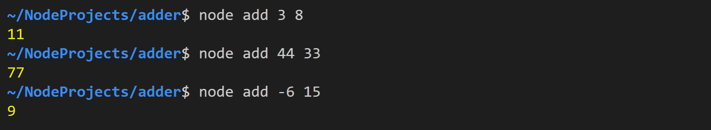
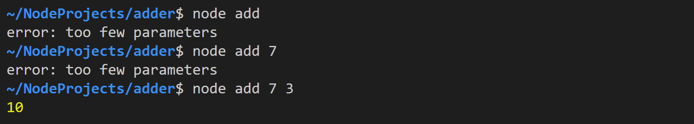
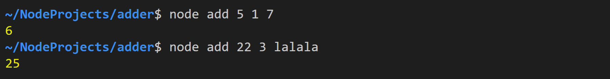
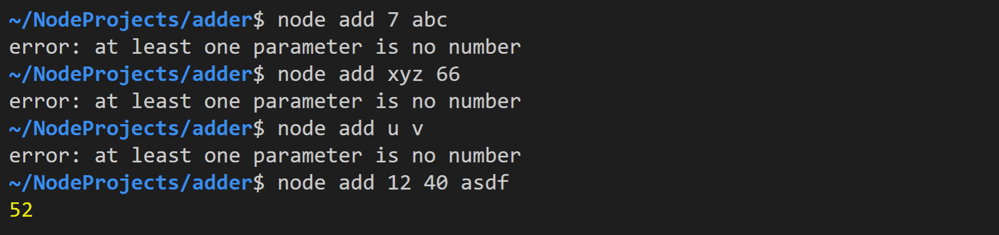
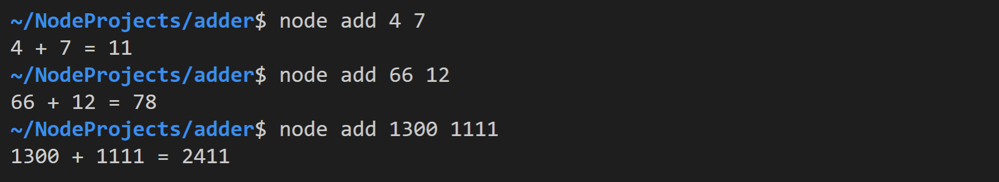
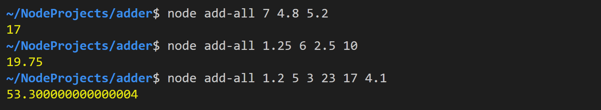
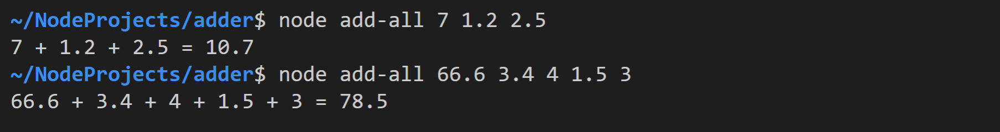

# Adder

## App `add`

Erstellen Sie die Datei `add.ts` und implementieren Sie darin folgende Funktionalität.

### Task 1: Add CLI arguments

Berechnen Sie die **ganzzahlige** Summe **der beiden ersten** Kommandozeilenparameter.

### Task 2: Error handling

Prüfen Sie zu Beginn des Programms, ob beim Aufruf mindestens zwei Parameter übergeben wurden.

Bei mehr als zwei Parametern, soll kein Fehler ausgegeben werden -  die weiteren Parameter werden einfach ignoriert.

Prüfen Sie, ob die Umwandlung in den Datentyp `number` erfolgreich war.

Beenden Sie im Fehlerfall die Ausführung des Programms mithilfe von `process.exit()`.

### Task 3: Print two summands

Geben Sie am Programmende, mithilfe eines `template string`, auch die beiden Summanden aus.

## App `add-all`

Erstellen Sie die Datei `add-all.ts` und implementieren Sie darin folgende Funktionalität.

### Task 4: Add all CLI arguments

Berechnen Sie die Summe **aller** Kommandozeilenparameter. Dabei sollen auch Dezimalzahlen möglich sein.

Geben Sie (wie bei *Task 2*) Fehlermeldungen aus:

- falls weniger als zwei Parameter übergeben wurden
- falls die Umwandlung in den Datentyp `number` nicht erfolgreich war

### Task 5: Print all summands

Geben Sie am Programmende auch alle Summanden aus.

